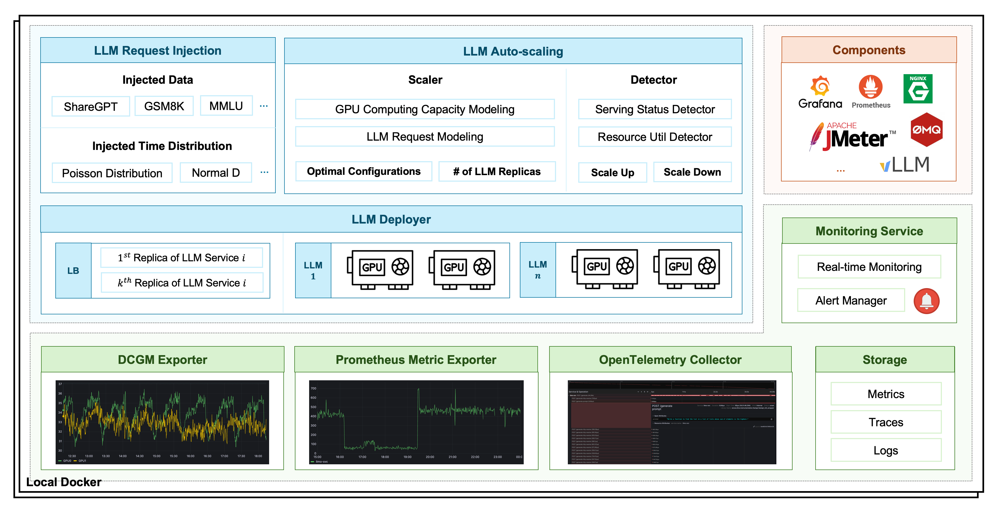

# ENOVA 

<a href=''></a>
[](https://github.com/Emerging-AI/ENOVA?tab=Apache-2.0-1-ov-file)


ENOVA is an open-source llm deployment, monitoring, injection and auto-scaling service.
Since the increasing popularity of large language model (LLM) backend systems, it is common and necessary to
deploy stable serverless serving of LLM on GPU clusters with auto-scaling. 
However, there exist challenges because the diversity and co-location of applications in GPU clusters 
will lead to low service quality and GPU utilization. 
To address them, we build ENOVA, which deconstructs the execution process of LLM service comprehensively
and designs a configuration recommendation module for automatic deployment on any GPU clusters 
and a performance detection module for auto-scaling. 
On top of them, ENOVA implements a deployment execution engine for GPU cluster scheduling.


## 🤖 Architecture of ENOVA

<p align="center">

</p>


## ✈️ Getting Started

### Requirement

* OS: Linux
* Docker
* Python: >=3.10
* GPU: Nvidia GPUs with compute capability 7.0 or higher

### Installation

1. Make sure you have [Docker](https://docs.docker.com/engine/install/) 
and [Python](https://docs.anaconda.com/free/anaconda/install/index.html) Environment.

2. Use pip to install ENOVA:
```bash
# Create a new Python environment
conda create -n enova_env python=3.10
conda activate enova_env

# Install ENOVA
# Source: https://pypi.python.org/simple/
pip install enova_instrumentation_llmo
pip install enova
```

3. To verify the installation, run:
```bash
enova -h 
```


### Quickstart

1. Start an all-in-one LLM server with deployment, monitoring, injection and auto-scaling service: 

```bash
enova pilot run --model mistralai/Mistral-7B-Instruct-v0.1
```

Use proxy to download LLMs:

```bash
enova pilot run --model mistralai/Mistral-7B-Instruct-v0.1 --hf_proxy xxx
```

> [!NOTE]
> 
> * First, we use docker-compose to start grafana, prometheus, opentelmentry-collector, tempo, dcgm modules.
> * Second, we start a streamlit webui service.
> * Third, we launch the llm server with default vllm backend.

> [!TIP]
> 
> * The default port of LLM service is 9199.
> * The default port of grafana server is 32827.
> * The default port of LLM webUI server is 8501.
> * The default port of ENOVA application server is 8182.


2. Check Deployed LLM service via ENOVA Application Server:

```text
http://localhost:8182/instance
```


3. Test the Deployed LLM service with an prompt:

Use WebUI:

```text
http://localhost:8501
```

Use Shell:

```bash
curl -X POST http://localhost:9199/generate \
-d '{
"prompt": "San Francisco is a",
"max_tokens": 1024,
"temperature": 0.9,
"top_p": 0.9
}'
```

4. Monitor the LLM Service Quality via ENOVA Application Server:

```text
http://localhost:8182/instance
```


## 🏠 LLM Deployment Service

In addition to offering an all-in-one solution for service deployment, monitoring, and autoscaling, 
ENOVA also provides support for single modules.

The LLM deployment service facilitates the deployment of LLMs and provides a stable API for accessing LLMs. 

```bash
enova enode run --model mistralai/Mistral-7B-Instruct-v0.1
```

> [!NOTE]
> 
> The LLM server is launched with default vllm backend.
> OpenAI API and Generate API are both supported. 
> vllm config can be specified using command-line parameters like:
```bash
enova enode run --model mistralai/Mistral-7B-Instruct-v0.1 --host 127.0.0.1 --port 9199
```


### LLM WebUI Service

This service features a WebUI page for dialog interaction, 
where the serving host and port for the LLM server, and the host and port for the WebUI service, 
are configurable parameters.

```bash
enova webui run --serving_host 127.0.0.1 --serving_port 9199 --host 127.0.0.1 --port 8501
```


### Autoscaling Module

The autoscaling service is automatically launched and managed by escaler module. 


### Request Injection Module

We implemented a request injection module using JMeter to simulate real user requests for evaluating LLM performance. 
The module allows simulation of request arrival probabilities using two modes: Poisson distribution and normal distribution. 
Further details on the injection operation are available at:
```text
http://localhost:8182/instance
```


## 🏠 LLM Monitoring Service 

### Manage LLM Monitoring Service

The monitoring system is designed for monitoring and autoscaling, 
which contains real-time data collection, storage, and consumption.
We can manage the LLM monitoring service via:

1. Start llm monitoring service

```bash
enova mon start
```

2. Check service status 

```bash
enova mon status
```

3. Stop monitoring service

```bash
enova mon stop
```


### Monitoring Metrics

Monitoring metrics are collected using the DCGM exporter, Prometheus exporters, and the OpenTelemetry collector. 
A brief description is provided in the following tables. For more details, please refer to the Grafana dashboard.

```text
http://localhost:32827/dashboards

# default user / passwd
admin / grafana
```


| Metric Type     | Metric Description                                              |
|-----------------|-----------------------------------------------------------------|
| API Service     | The number of requests sent to LLM services per second          |
| API Service     | The number of requests processed by LLM services per second     |
| API Service     | The number of requests successfully processed per second        |
| API Service     | The success rate of requests processed by LLM services per second |
| API Service     | The number of requests being processed by LLM services          |
| API Service     | The average execution time per request processed by LLM services |
| API Service     | The average request size of requests per second                 |
| API Service     | The average response size of requests per second                |
| LLM Performance | The average prompt throughput per second                        |
| LLM Performance | The average generation throughput per second                    |
| LLM Performance | The number of requests being processed by the deployed LLM      |
| LLM Performance | The number of requests being pended by the deployed LLM         |                           
| LLM Performance | The utilization ratio of memory allocated for KV cache          | 
| GPU Utilization | DCGM Metrics, like DCGM_FI_DEV_GPU_UTIL.                        |


## 📚 Reference

```text
@inproceedings{tao2024ENOVA,
  title={ENOVA: Autoscaling towards Cost-effective and Stable Serverless LLM Serving},
  author={Tao Huang and Pengfei Chen and Kyoka Gong and Jocky Hawk and Zachary Bright and Wenxin Xie and Kecheng Huang and Zhi Ji},
  booktitle={arXiv preprint arXiv:},
  year={2024}
}
```

## 🤝 Join Our Community

We use Slack workspace for the collaboration on building ENOVA.

* [Slack workspace](https://join.slack.com/t/emergingai/shared_invite/zt-2i9ngqa10-OU8SsVJbV0mqTBrjjt5rmQ)
