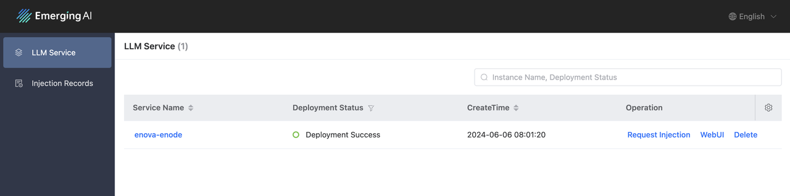
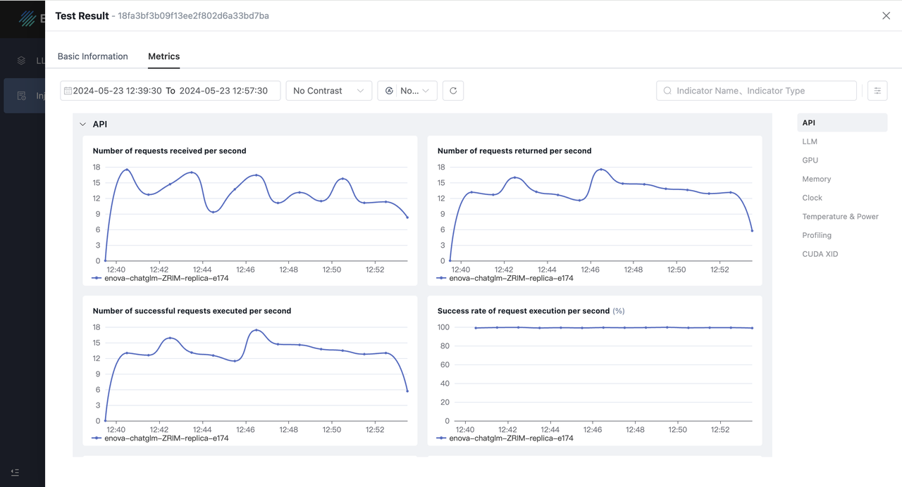
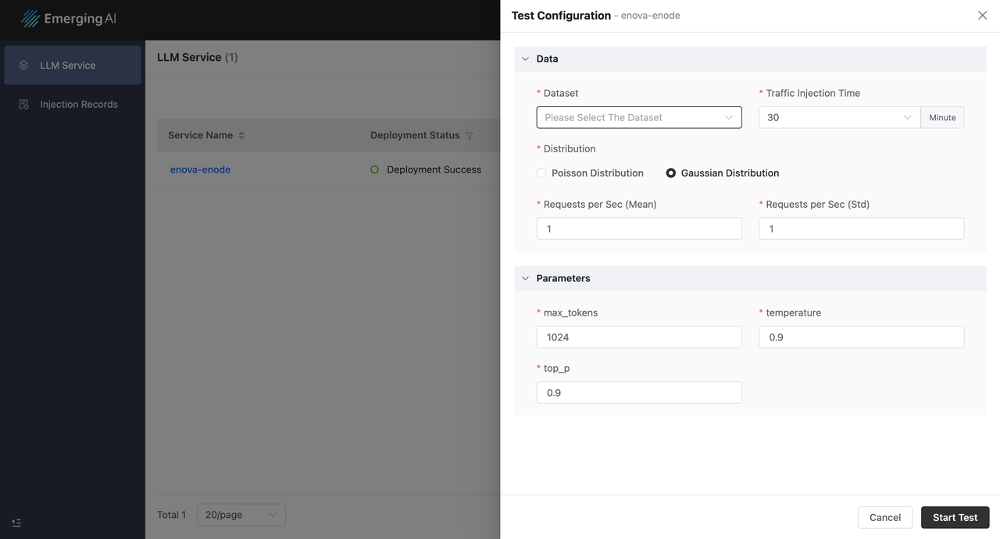
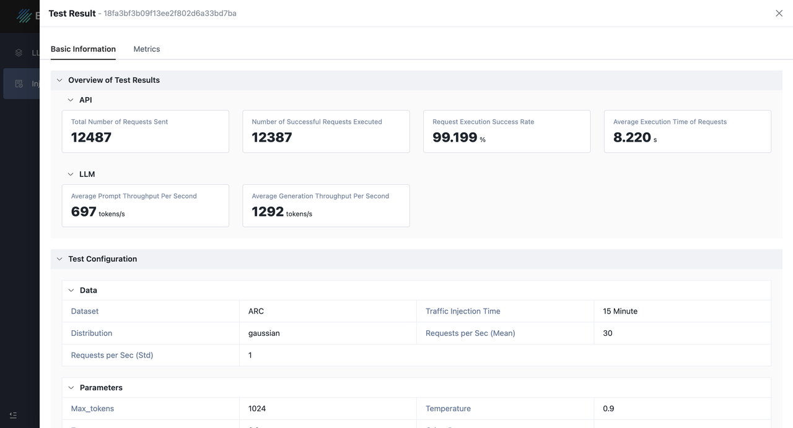

#### [**English**](https://github.com/Emerging-AI/ENOVA) | [**中文**](https://github.com/Emerging-AI/ENOVA/blob/master/README_ZH.md)

# ENOVA 

<a href=''></a>
[](https://github.com/Emerging-AI/ENOVA?tab=Apache-2.0-1-ov-file)


ENOVA is an open-source service for LLM deployment, monitoring, injection, and auto-scaling. 
With the increasing popularity of large language model (LLM) backend systems, deploying stable 
serverless LLM services on GPU clusters with auto-scaling has become essential. 
However, challenges arise due to the diversity and co-location of applications in GPU clusters, 
leading to low service quality and GPU utilization. 

To address these issues, ENOVA deconstructs the LLM service execution process and incorporates
a configuration recommendation module for automatic deployment on any GPU cluster 
and a performance detection module for auto-scaling. 
Additionally, ENOVA features a deployment execution engine for efficient GPU cluster scheduling.

With **ENOVA**, users can:
- Build and deploy LLM with only few command lines
- Recommend optimal computing resources and operating parameter configurations for LLM
- Quick experience LLM performance with ENOVA by request injection offered
- In-depth observation of LLM operating status and abnormal self-healing
- Achieve load balancing through autoscaling

Here are ENOVA's core technical points and values:
- **Configuration Recommendation**: ENOVA can automatically identify various LLMs (open-source or fine-tuned), 
and recommend the most suitable parameter configurations for deploying the model, 
such as GPU type, maximal batch size, replicas, weights etc.
- **Performance Detection**: ENOVA enables real-time monitoring of service quality 
and abnormal usage of computational resources. 
- **Deep Observability**: By conducting in-depth observation of the entire chain of task execution of large models, 
we can provide the best guidance for maximizing model performance and optimizing the utilization of computing resources.
- **Deployment & Execution**: Achieve rapid deployment and model serving, aiming to achieve autoscaling objectives.

<p align="center">

</p>

Based on the aforementioned capabilities of ENOVA, we can ensure that LLM services with ENOVA are:
- **Stable**: Achieve a high availability rate of over 99%, ensuring stable operation without downtime.
- **Cost-effective**: Increase resource utilization by over 50% and enhance comprehensive GPU memory utilization from 40% to 90%.
- **Efficient**: Boost deployment efficiency by over 10 times and run LLMs with lower latency and higher throughputs
- **Strong Scalability**: ENOVA can automatically cluster different task types, thus adapting to applications in many fields.

## ✈️ Getting Started

We can demonstrate the powerful capabilities of E NOVA in model deployment and performance monitoring 
by swiftly running an open-source AI model on your GPUs and conducting request injection tests.

### Requirement

- OS: Linux
- Docker
- Python: >=3.10
- GPU: Nvidia GPUs with compute capability 7.0 or higher

> [!NOTE]
> 
> If the above conditions are not met, the installation and operation of ENOVA may fail. 
> If you do not have available GPU resources, 
> we recommend that you use the free GPU resources on Google Colab to install and experience ENOVA.

### Installation

1. Make sure you have [Docker](https://docs.docker.com/engine/install/) 
and [Python](https://docs.anaconda.com/free/anaconda/install/index.html) Environment.

2. Use pip to install ENOVA:
```bash
# Create a new Python environment
conda create -n enova_env python=3.10
conda activate enova_env

# Install ENOVA
# Source: https://pypi.python.org/simple/
pip install enova_instrumentation_llmo
pip install enova
```

3. To verify the installation, run:
```bash
enova -h 
```

The expected output is:
```text
Usage: enova [OPTIONS] COMMAND [ARGS]...

  ███████╗███╗   ██╗ ██████╗ ██╗   ██╗ █████╗
  ██╔════╝████╗  ██║██╔═══██╗██║   ██║██╔══██╗
  █████╗  ██╔██╗ ██║██║   ██║██║   ██║███████║
  ██╔══╝  ██║╚██╗██║██║   ██║╚██╗ ██╔╝██╔══██║
  ███████╗██║ ╚████║╚██████╔╝ ╚████╔╝ ██║  ██║
  ╚══════╝╚═╝  ╚═══╝ ╚═════╝   ╚═══╝  ╚═╝  ╚═╝

  ENOVA is an open-source llm deployment, monitoring, injection and auto-scaling service.
  It provides a set of commands to deploy stable serverless serving of LLM on GPU clusters with auto-scaling.

Options:
  -v, --version  Show the version and exit.
  -h, --help     Show this message and exit.

Commands:
  algo      Run the autoscaling service.
  app       Start ENOVA application server.
  enode     Deploy the target LLM and launch the LLM API service.
  injector  Run the autoscaling service.
  mon       Run the monitors of LLM server
  pilot     Start an all-in-one LLM server with deployment, monitoring,...
  webui     Build agent at this page based on the launched LLM API service.
```

### Quickstart

1. Start an all-in-one LLM server with deployment, monitoring, injection and auto-scaling service: 

```bash
enova pilot run --model mistralai/Mistral-7B-Instruct-v0.1

# openai
enova pilot run --model mistralai/Mistral-7B-Instruct-v0.1 --vllm_mode openai
```

Use proxy to download LLMs:

```bash
enova pilot run --model mistralai/Mistral-7B-Instruct-v0.1 --hf_proxy xxx
```

> [!TIP]
> 
> - The default port of LLM service is 9199.
> - The default port of grafana server is 32827.
> - The default port of LLM webUI server is 8501.
> - The default port of ENOVA application server is 8182.


2. Check Deployed LLM service via ENOVA Application Server:

```text
http://localhost:8182/instance
```

<p align="center">

</p>


3. Test the Deployed LLM service with an prompt:

Use WebUI:

```text
http://localhost:8501
```

Use Shell:

```bash
curl -X POST http://localhost:9199/generate \
-d '{
"prompt": "San Francisco is a",
"max_tokens": 1024,
"temperature": 0.9,
"top_p": 0.9
}'

# openai
curl http://localhost:9199/v1/completions \
-H "Content-Type: application/json" \
-d '{
"model": "mistralai/Mistral-7B-Instruct-v0.1",
"prompt": "San Francisco is a",
"max_tokens": 128,
"temperature": 0
}'
```

4. Monitor the LLM Service Quality via ENOVA Application Server:

```text
http://localhost:8182/instance
```

<p align="center">

</p>

5. Stop all service
```
enova pilot stop --service all
```


## 🏠 LLM Deployment Service

In addition to offering an all-in-one solution for service deployment, monitoring, and autoscaling, 
ENOVA also provides support for single modules.

The LLM deployment service facilitates the deployment of LLMs and provides a stable API for accessing LLMs. 

### Run an LLM

```bash
enova enode run --model mistralai/Mistral-7B-Instruct-v0.1
```

> [!NOTE]
> 
> The LLM server is launched with default vllm backend.
> OpenAI API and Generate API are both supported. 
> vllm config can be specified using command-line parameters like:
```bash
enova enode run --model mistralai/Mistral-7B-Instruct-v0.1 --host 127.0.0.1 --port 9199
```


### LLM WebUI Service

This service features a WebUI page for dialog interaction, 
where the serving host and port for the LLM server, and the host and port for the WebUI service, 
are configurable parameters.

```bash
enova webui run --serving_host 127.0.0.1 --serving_port 9199 --host 127.0.0.1 --port 8501
```

<p align="center">

</p>


### Autoscaling Module

The autoscaling service is automatically launched and managed by escaler module. 


### Request Injection Module

We implemented a request injection module using JMeter to simulate real user requests for evaluating LLM performance. 
The module allows simulation of request arrival probabilities using two modes: Poisson distribution and normal distribution. 
Further details on the injection operation are available at:
```text
http://localhost:8182/instance
```

<p align="center">

</p>

<p align="center">

</p>


## 🏠 LLM Monitoring Service 

### Manage LLM Monitoring Service

The monitoring system is designed for monitoring and autoscaling, 
which contains real-time data collection, storage, and consumption.
We can manage the LLM monitoring service via:

1. Start llm monitoring service

```bash
enova mon start
```

2. Check service status 

```bash
enova mon status
```

3. Stop monitoring service

```bash
enova mon stop
```


### Monitoring Metrics

Monitoring metrics are collected using the DCGM exporter, Prometheus exporters, and the OpenTelemetry collector. 
A brief description is provided in the following tables. For more details, please refer to the Grafana dashboard.


| Metric Type     | Metric Description                                              |
|-----------------|-----------------------------------------------------------------|
| API Service     | The number of requests sent to LLM services per second          |
| API Service     | The number of requests processed by LLM services per second     |
| API Service     | The number of requests successfully processed per second        |
| API Service     | The success rate of requests processed by LLM services per second |
| API Service     | The number of requests being processed by LLM services          |
| API Service     | The average execution time per request processed by LLM services |
| API Service     | The average request size of requests per second                 |
| API Service     | The average response size of requests per second                |
| LLM Performance | The average prompt throughput per second                        |
| LLM Performance | The average generation throughput per second                    |
| LLM Performance | The number of requests being processed by the deployed LLM      |
| LLM Performance | The number of requests being pended by the deployed LLM         |                           
| LLM Performance | The utilization ratio of memory allocated for KV cache          | 
| GPU Utilization | DCGM Metrics, like DCGM_FI_DEV_GPU_UTIL.                        |


More detailed metrics can be viewed on our application server. 
In the process of deploying the all-in-one llm service with ENOVA, 
we also created the corresponding indicator dashboard in Grafana and supported viewing of more detailed trace data.

- URL：http://localhost:32827/dashboards
- Default user account：admin
- Password：grafana


#### GPU Metrics

<p align="center">

</p>

#### Traces

<p align="center">

</p>


## 📚 Reference

```text
@inproceedings{tao2024ENOVA,
  title={ENOVA: Autoscaling towards Cost-effective and Stable Serverless LLM Serving},
  author={Tao Huang and Pengfei Chen and Kyoka Gong and Jocky Hawk and Zachary Bright and Wenxin Xie and Kecheng Huang and Zhi Ji},
  booktitle={arXiv preprint arXiv:},
  year={2024}
}
```

## 🤝 Join Our Community

We use Slack workspace for the collaboration on building ENOVA.

- [Slack workspace](https://join.slack.com/t/emergingai/shared_invite/zt-2i9ngqa10-OU8SsVJbV0mqTBrjjt5rmQ)
- Browse our [website](https://www.emergingai.pro/) for more informations
