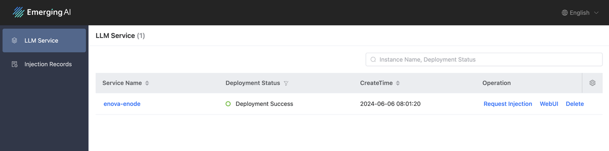
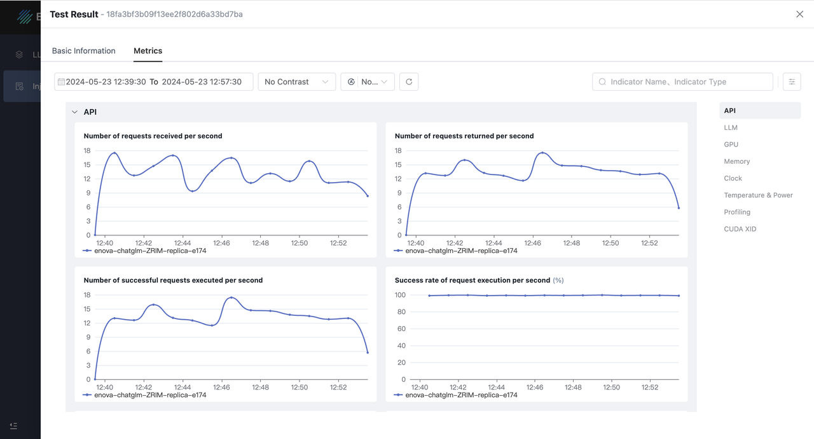
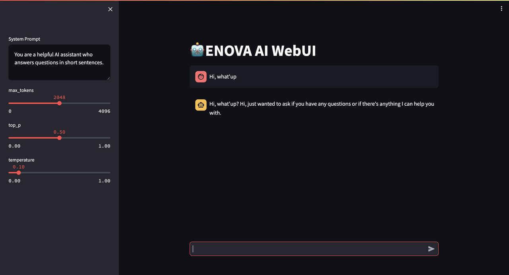
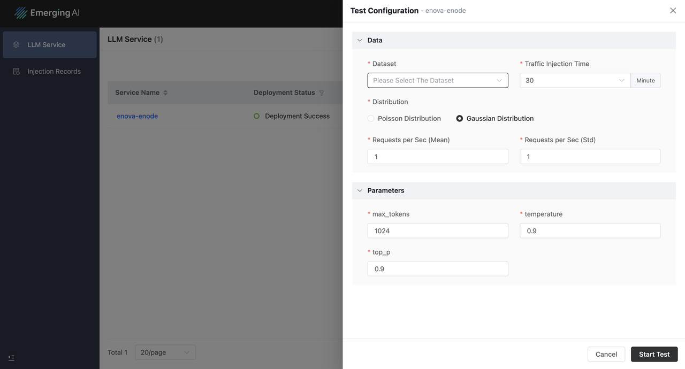
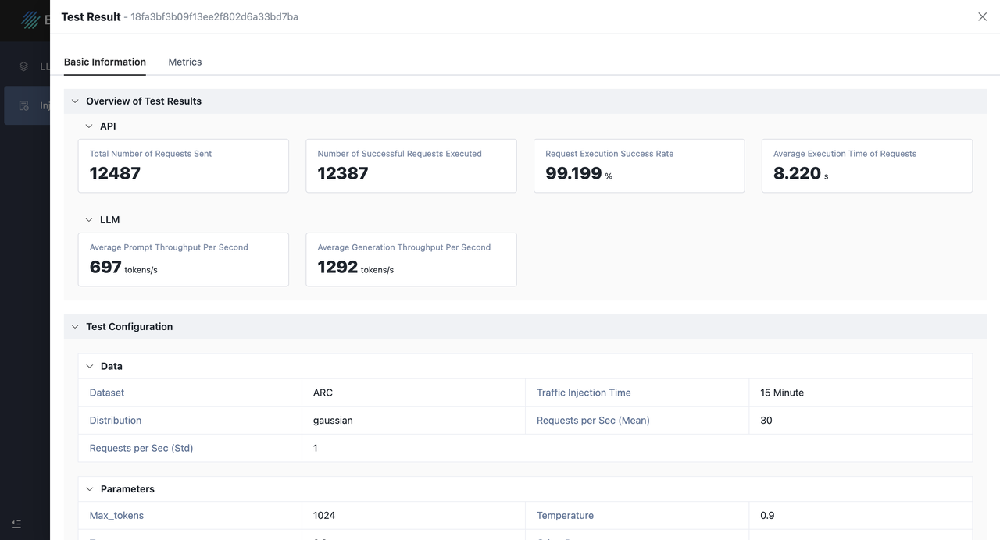
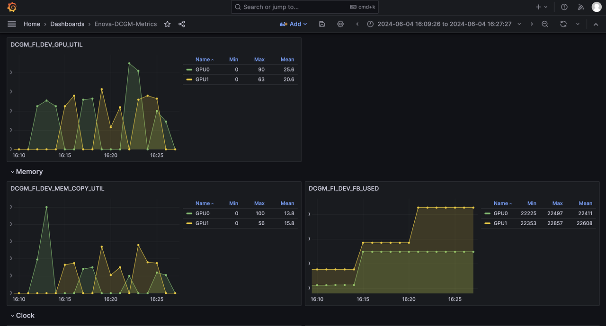
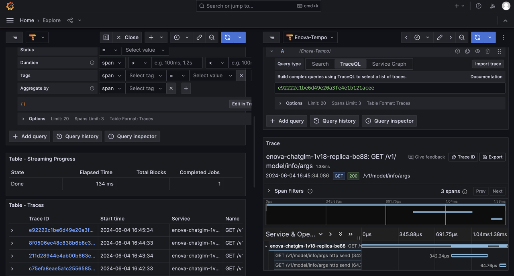

#### [**English**](https://github.com/Emerging-AI/ENOVA) | [**中文**](https://github.com/Emerging-AI/ENOVA/blob/master/README_ZH.md)

# ENOVA 

<a href=''></a>
[](https://github.com/Emerging-AI/ENOVA?tab=Apache-2.0-1-ov-file)


ENOVA 是一种用于 LLM 部署、监控、注入和自动扩展的开源服务。
随着大型语言模型 (LLM) 后端系统的日益普及，在 GPU 集群上部署具有自动扩展功能的稳定无服务器 LLM 服务已变得至关重要。
然而，由于 GPU 集群中应用程序的多样性和共置性，出现了一些挑战，导致服务质量和 GPU 利用率低下。

为了解决这些问题，ENOVA 解构了 LLM 服务执行过程，并结合了用于在任何 GPU 集群上自动部署的配置推荐模块和用于自动扩展的性能检测模块。
此外，ENOVA 还具有部署执行引擎，可实现高效的 GPU 集群调度。

通过 **ENOVA**, 用户可以:
- 仅需几行命令即可构建和部署 LLM
- 为 LLM 推荐最佳计算资源和运行参数配置
- 通过请求注入快速体验 ENOVA 的 LLM 性能
- 深入观察 LLM 运行状态和异常自愈
- 通过自动扩缩实现负载平衡

以下是 ENOVA 的核心技术点和价值：
- **配置推荐**：ENOVA 可以自动识别各种 LLM（开源或微调），并推荐最适合部署模型的参数配置，例如 GPU 类型、最大批处理大小、副本、权重等。
- **性能检测**：ENOVA 可以实时监控服务质量和计算资源的异常使用情况。
- **深度可观测性**：通过对大型模型的整个任务执行链进行深入观察，我们可以为最大化模型性能和优化计算资源的利用率提供最佳指导。
- **部署执行**：实现快速部署和模型服务，以达到自动扩展的目标。


<p align="center">

</p>

基于上述ENOVA的能力，我们可以确保使用ENOVA的LLM服务：
- 稳定：实现99%以上的高可用率，确保稳定运行而不停机。
- 性价比高：资源利用率提升50%以上，综合GPU内存利用率从40%提升到90%。
- 高效：部署效率提升10倍以上，以更低的延迟和更高的吞吐量运行LLM
- 强大的可扩展性：ENOVA可以自动对不同类型的任务进行聚类，从而适应许多领域的应用。


## ✈️ Getting Started

我们可以在您的GPU上快速运行开源AI模型并进行请求注入测试，以展示ENOVA在模型部署和性能监控方面的强大能力。

### 环境要求

1. 操作系统：Linux
2. Docker
3. Python：>=3.10
4. GPU：计算能力 7.0 或更高的 Nvidia GPU

> [!NOTE]
> 
> 如果不满足上述条件，ENOVA 的安装和运行可能会失败。如果您没有可用的 GPU 资源，
> 我们建议您使用 Google Colab 上的免费 GPU 资源来安装和体验 ENOVA。

### 安装

1. 确保您拥有 [Docker](https://docs.docker.com/engine/install/) 
和 [Python](https://docs.anaconda.com/free/anaconda/install/index.html) 环境.

2. 使用pip安装ENOVA:
```bash
# Create a new Python environment
conda create -n enova_env python=3.10
conda activate enova_env

# Install ENOVA
# Source: https://pypi.python.org/simple/
pip install enova_instrumentation_llmo
pip install enova
```

3. 您可以使用此命令行检查安装是否成功:
```bash
enova -h 
```

预期输出为：
```text
Usage: enova [OPTIONS] COMMAND [ARGS]...

  ███████╗███╗   ██╗ ██████╗ ██╗   ██╗ █████╗
  ██╔════╝████╗  ██║██╔═══██╗██║   ██║██╔══██╗
  █████╗  ██╔██╗ ██║██║   ██║██║   ██║███████║
  ██╔══╝  ██║╚██╗██║██║   ██║╚██╗ ██╔╝██╔══██║
  ███████╗██║ ╚████║╚██████╔╝ ╚████╔╝ ██║  ██║
  ╚══════╝╚═╝  ╚═══╝ ╚═════╝   ╚═══╝  ╚═╝  ╚═╝

  ENOVA is an open-source llm deployment, monitoring, injection and auto-scaling service.
  It provides a set of commands to deploy stable serverless serving of LLM on GPU clusters with auto-scaling.

Options:
  -v, --version  Show the version and exit.
  -h, --help     Show this message and exit.

Commands:
  algo      Run the autoscaling service.
  app       Start ENOVA application server.
  enode     Deploy the target LLM and launch the LLM API service.
  injector  Run the autoscaling service.
  mon       Run the monitors of LLM server
  pilot     Start an all-in-one LLM server with deployment, monitoring,...
  webui     Build agent at this page based on the launched LLM API service.
```

### 快速开始

1. 启动一个集部署、监控、请求注入和自动扩展服务于一体的LLM服务器：

```bash
enova pilot run --model mistralai/Mistral-7B-Instruct-v0.1

# openai
enova pilot run --model mistralai/Mistral-7B-Instruct-v0.1 --vllm_mode openai
```

如果您的GPU设置了代理，则可以使用以下命令行：

```bash
enova pilot run --model mistralai/Mistral-7B-Instruct-v0.1 --hf_proxy xxx
```

> [!TIP]
> 
> - LLM API服务的默认端口是9199.
> - Grafana服务的默认端口是32827.
> - LLM WebUI服务的默认端口是8501.
> - LLM部署完成后的应用服务的默认端口是8182.


2. 通过ENOVA应用服务器检查已部署的LLM服务:

```text
http://localhost:8182/instance
```

<p align="center">

</p>


3. 使用提示词测试已部署的LLM服务:

使用WebUI:

```text
http://localhost:8501
```

使用Shell:

```bash
curl -X POST http://localhost:9199/generate \
-d '{
"prompt": "San Francisco is a",
"max_tokens": 1024,
"temperature": 0.9,
"top_p": 0.9
}'

# openai
curl http://localhost:9199/v1/completions \
-H "Content-Type: application/json" \
-d '{
"model": "mistralai/Mistral-7B-Instruct-v0.1",
"prompt": "San Francisco is a",
"max_tokens": 128,
"temperature": 0
}'
```

4. 使用 ENOVA 应用服务器监控 LLM 服务质量，提供跨服务、模型、节点和硬件层的性能全面视图。自动扩展和配置更新将根据实时观察自动执行。

```text
http://localhost:8182/instance
```

<p align="center">

</p>

5. 关闭所有服务
```
enova pilot stop --service all
```


## 🏠 LLM 部署

除了提供服务部署、监控和自动扩展的一体化解决方案外，ENOVA 还支持单独的模块。

LLM 部署服务简化了 LLM 的部署，并提供了稳定的 API 以实现无缝访问。

### 运行 LLM

```bash
enova enode run --model mistralai/Mistral-7B-Instruct-v0.1
```

> [!NOTE]
> 
> LLM 服务器使用默认的 vllm 后端启动。OpenAI API 和 Generate API 均受支持。可以使用命令行参数指定 vllm 配置，例如:
```bash
enova enode run --model mistralai/Mistral-7B-Instruct-v0.1 --host 127.0.0.1 --port 9199
```


### LLM WebUI 服务

该服务具有用于对话交互的WebUI页面，其中LLM服务器的服务主机和端口以及WebUI服务的主机和端口是可配置参数。

```bash
enova webui run --serving_host 127.0.0.1 --serving_port 9199 --host 127.0.0.1 --port 8501
```

<p align="center">

</p>


### 自动扩缩容

自动伸缩服务由 escaler 模块自动启动和管理，我们的开源版本支持单节点自动伸缩，如果您需要更大集群的自动伸缩，请通过官网、GitHub、Slack 与我们联系。

### 请求注入测试

我们使用 JMeter 实现了一个请求注入模块，以模拟真实用户请求来评估 LLM 性能。该模块允许使用两种模式模拟请求到达概率：泊松分布和正态分布。有关注入操作的更多详细信息，请访问：
```text
http://localhost:8182/instance
```

<p align="center">

</p>

<p align="center">

</p>


## 🏠 LLM 监控服务 

### 管理 LLM 监控服务

监控系统专为监控和自动扩展而设计，包含实时数据收集、存储和使用。我们可以通过以下方式管理 LLM 监控服务：

1. 启动 LLM 监控服务

```bash
enova mon start
```

2. 检查服务状态 

```bash
enova mon status
```

3. 停止 LLM 监控服务

```bash
enova mon stop
```


### 监控指标

监控指标使用 DCGM 导出器、Prometheus 导出器和 OpenTelemetry 收集器进行收集。下表提供了简要说明。
可以在我们的应用服务器上查看更详细的指标：


| Metric Type     | Metric Description                                              |
|-----------------|-----------------------------------------------------------------|
| API Service     | The number of requests sent to LLM services per second          |
| API Service     | The number of requests processed by LLM services per second     |
| API Service     | The number of requests successfully processed per second        |
| API Service     | The success rate of requests processed by LLM services per second |
| API Service     | The number of requests being processed by LLM services          |
| API Service     | The average execution time per request processed by LLM services |
| API Service     | The average request size of requests per second                 |
| API Service     | The average response size of requests per second                |
| LLM Performance | The average prompt throughput per second                        |
| LLM Performance | The average generation throughput per second                    |
| LLM Performance | The number of requests being processed by the deployed LLM      |
| LLM Performance | The number of requests being pended by the deployed LLM         |                           
| LLM Performance | The utilization ratio of memory allocated for KV cache          | 
| GPU Utilization | DCGM Metrics, like DCGM_FI_DEV_GPU_UTIL.                        |


在部署ENOVA一体化llm服务的过程中，我们还在Grafana中创建了相应的指标仪表盘，支持查看更详细的trace数据。

- URL：http://localhost:32827/dashboards
- 默认用户账号：admin
- 密码：grafana


#### GPU 指标案例

<p align="center">

</p>

#### Traces 案例

<p align="center">

</p>


## 📚 参考

```text
@inproceedings{tao2024ENOVA,
  title={ENOVA: Autoscaling towards Cost-effective and Stable Serverless LLM Serving},
  author={Tao Huang and Pengfei Chen and Kyoka Gong and Jocky Hawk and Zachary Bright and Wenxin Xie and Kecheng Huang and Zhi Ji},
  booktitle={arXiv preprint arXiv:},
  year={2024}
}
```

## 🤝 加入我们的社区

我们使用 Slack 工作区协作构建 ENOVA

* [Slack workspace](https://join.slack.com/t/emergingai/shared_invite/zt-2i9ngqa10-OU8SsVJbV0mqTBrjjt5rmQ)
* 通过我们的官网获取更多信息：https://www.emergingai.pro
